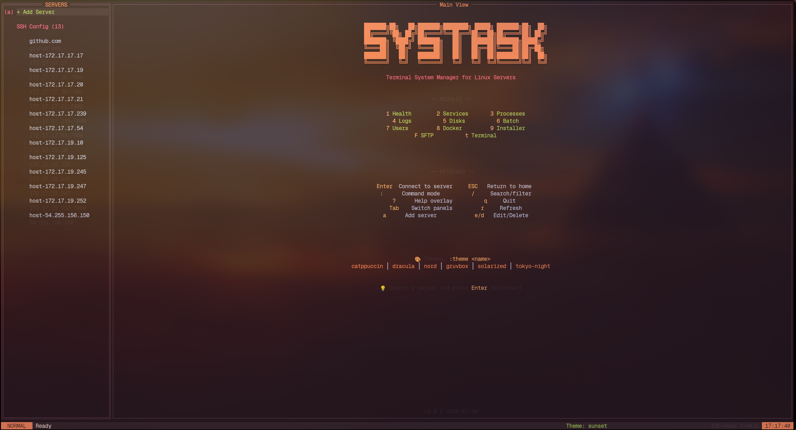

# SysTask

**Terminal System Manager for Linux Servers**

A powerful TUI (Terminal User Interface) application for managing multiple Linux servers via SSH. Monitor health, manage services, processes, Docker containers, and transfer files across your entire server fleet.



## ✨ Features

### Server Management
- **Multi-host connections** - Manage unlimited servers from one interface
- **SSH Config integration** - Auto-discovers hosts from `~/.ssh/config`
- **PEM key support** - AWS, Azure, GCP key-based authentication
- **Host groups** - Organize servers by environment (Production, Staging, etc.)

### 10 Modules
| Module | Key | Description |
|--------|-----|-------------|
| Health | `1` | CPU, Memory, Disk, Network metrics with visual gauges |
| Services | `2` | Systemd service management (start/stop/restart) |
| Processes | `3` | Process viewer with kill functionality |
| Logs | `4` | Real-time log viewer with filtering |
| Disks | `5` | Disk usage and mount point information |
| Batch | `6` | Execute commands across multiple servers |
| Users | `7` | User account management |
| Docker | `8` | Container management (start/stop/logs) |
| Installer | `9` | Package installation across servers |
| SFTP | `F` | Dual-pane file manager with transfer |

### Terminal Mode
Press `t` after connecting to launch a **fullscreen SSH terminal** - perfect for interactive sessions.

### 12 Themes
```
catppuccin │ dracula │ nord │ gruvbox │ solarized │ tokyo-night
monokai │ one-dark │ cyberpunk │ forest │ ocean │ sunset
```

## Current Installation method

Provide `.deb` or `rpm` on the [Release](https://github.com/onedord1/stk/releases/) page. Just downlaod a install with dpkg

Example Commands:
```
#Debian/Ununtu
wget https://github.com/onedord1/stk/releases/download/v1.0.3/systask_1.0.3_amd64.deb
sudo dpkg -i systask_1.0.3_amd64.deb
```
```
#Fedora/RHEL/CentOS
wget https://github.com/onedord1/stk/releases/download/v1.0.3/systask-1.0.3-1.x86_64.rpm
sudo rpm -i systask-1.0.3-1.x86_64.rpm
# or
sudo dnf install ./systask-1.0.3-1.x86_64.rpm
```

---
## 🚀 PPA Installation (Coming soon Working On it)

### Package Manager (Recommended)

#### Debian/Ubuntu
```bash
sudo apt update
sudo apt install systask
```

#### Fedora/RHEL/CentOS
```bash
sudo dnf install systask
# or for older systems
sudo yum install systask
```

#### Arch Linux
```bash
sudo pacman -S systask
```

#### Alpine Linux
```bash
sudo apk add systask
```

### From Source
```bash
# Clone repository
git clone https://github.com/onedord1/stk.git
cd stk

# Build and install
./scripts/install.sh

# Or manual build
go build -o systask ./main.go
sudo install -Dm755 systask /usr/local/bin/systask
```

### Binary Release
Download the latest binary from [Releases](https://github.com/onedord1/stk/releases).

```bash
# Linux AMD64
curl -LO https://github.com/onedord1/stk/releases/latest/download/systask-linux-amd64
chmod +x systask-linux-amd64
./systask-linux-amd64

# Linux ARM64
curl -LO https://github.com/onedord1/stk/releases/latest/download/systask-linux-arm64
chmod +x systask-linux-arm64
./systask-linux-arm64
```

## ⌨️ Keyboard Shortcuts

### Global
| Key | Action |
|-----|--------|
| `Enter` | Connect to selected server |
| `ESC` | Return to home screen |
| `:` | Command mode |
| `/` | Search/filter |
| `?` | Help overlay |
| `q` | Quit |
| `Tab` | Switch panels |
| `r` | Refresh |

### Server Management
| Key | Action |
|-----|--------|
| `a` | Add new server |
| `e` | Edit server |
| `d` | Delete server |

### Module Switching
| Key | Module |
|-----|--------|
| `1-9` | Modules 1-9 |
| `F` | SFTP file manager |
| `t` | Fullscreen terminal |

## ⚙️ Configuration

Configuration is stored at `~/.config/systask/config.yaml`.

### Sample Configuration
```yaml
theme: catppuccin

hosts:
  - name: production-web
    hostname: 192.168.1.10
    port: 22
    user: admin
    key_path: ~/.ssh/id_rsa
    group: Production
    
  - name: staging-api
    hostname: 10.0.0.50
    port: 22
    user: deploy
    auth_type: password
    group: Staging

groups:
  - name: Production
    color: "#ff5555"
  - name: Staging
    color: "#f1fa8c"
  - name: Development
    color: "#50fa7b"
```

### Configuration Options

| Option | Type | Description |
|--------|------|-------------|
| `theme` | string | Theme name (see themes list) |
| `hosts` | array | List of host configurations |
| `groups` | array | Custom host groups |

### Host Options

| Option | Type | Required | Description |
|--------|------|----------|-------------|
| `name` | string | Yes | Display name |
| `hostname` | string | Yes | IP or hostname |
| `port` | int | No | SSH port (default: 22) |
| `user` | string | No | SSH username |
| `key_path` | string | No | Path to SSH key file |
| `auth_type` | string | No | `key`, `password`, or `agent` |
| `group` | string | No | Group name for organization |

## 🎨 Themes

Switch themes with `:theme <name>` command.

| Theme | Description |
|-------|-------------|
| `catppuccin` | Warm pastel colors (default) |
| `dracula` | Dark purple/pink accent |
| `nord` | Arctic blue palette |
| `gruvbox` | Retro green/orange tones |
| `solarized` | Precision colors by Ethan Schoonover |
| `tokyo-night` | Based on Tokyo Night VS Code theme |
| `monokai` | Classic dark theme |
| `one-dark` | Atom One Dark inspired |
| `cyberpunk` | Neon pink and cyan |
| `forest` | Earthy greens |
| `ocean` | Deep blue tones |
| `sunset` | Warm orange gradients |

## 📦 Modules Guide

### Health (1)
Real-time system metrics:
- CPU usage with per-core breakdown
- Memory and swap usage
- Disk I/O statistics
- Network throughput

### Services (2)
Manage systemd services:
- View all services with status
- Start/Stop/Restart services
- Enable/Disable on boot
- View service logs

### Batch (6)
Execute commands on multiple servers:
1. Select hosts with `Space`
2. Press `Tab` to enter command
3. Press `Enter` to execute
4. View results per host

### SFTP (F)
Dual-pane file manager:
- Navigate with arrow keys
- Select files with `Space`
- Copy with `c`, Move with `m`
- Switch panels with `Tab`
- Change host with `h`

## 🔐 Security

### Authentication Methods
1. **SSH Key** (recommended) - Specify `key_path`
2. **SSH Agent** - Uses running ssh-agent
3. **Password** - Encrypted storage with AES-256-GCM

### Credential Storage
Passwords are encrypted using:
- AES-256-GCM encryption
- PBKDF2 key derivation
- Unique salt per installation

## 🛠️ Requirements

- Go 1.21+ (for building from source)
- SSH access to target servers
- Terminal with Unicode support

## 🤝 Contributing

Contributions are welcome! Please read [CONTRIBUTING.md](CONTRIBUTING.md) for guidelines.

## 📄 License

MIT License - see [LICENSE](LICENSE) for details.

## 🙏 Acknowledgments

- [tview](https://github.com/rivo/tview) - Terminal UI library
- [tcell](https://github.com/gdamore/tcell) - Terminal handling
- [golang.org/x/crypto](https://pkg.go.dev/golang.org/x/crypto) - SSH and encryption
